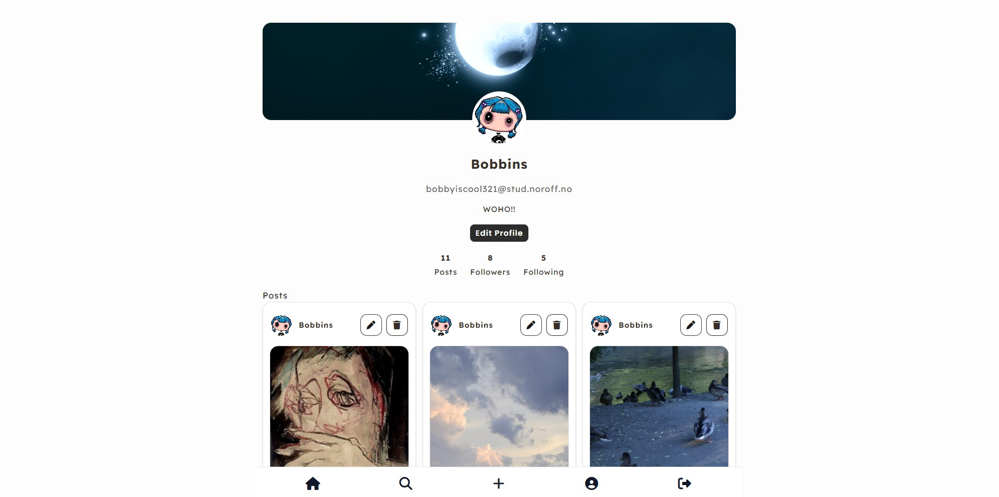

# JavaScript-2-Assignment / CSS Frameworks

## Social Media App — Frontend Development



This project simulates a minimal, functional social media environment where users can register, log in, create posts, follow others, react, and interact through comments. It is designed to demonstrate my ability to structure, plan, and develop a complete front-end application powered by the Noroff Social API.

The goal of the project is to create a responsive and interactive web application where users can:

- Create an account and log in securely
- Browse a global feed displaying all posts
- Create, edit, and delete their own posts
- React to posts using the ⭐ reaction
- Comment on posts
- View other users’ profiles and follow/unfollow them
- See their own profile details and their posts
- Search for posts through a search modal

This project focuses on JavaScript logic, API communication, modular code structure, and implementing CRUD operations.

### Project Background

This project was originally developed as my JavaScript 2 assignment and was later revisited for the CSS Frameworks assignment, where Tailwind CSS was introduced to selected parts of the application. At the time, the CSS Frameworks work was submitted as a separate pull request and was not fully merged into the main branch. As part of Portfolio 2, I returned to the project, merged the previous CSS Frameworks work, and continued improving and testing the application.

Because the project was built on an existing codebase, it currently contains both plain CSS and Tailwind CSS. With more time, I would continue migrating the remaining styles to Tailwind for greater consistency.

For Portfolio 2, I focused on improving functionality, mobile responsiveness, accessibility, and overall code quality and maintainability. This included addressing previous feedback, fixing interaction issues (like comments not working), cleaning up production code, and making the project more reliable and suitable for presentation.

## Getting Started

### Installing

1. Clone the repository:

```bash
git clone https://github.com/emmelinlarina/JavaScript-2.git
```

2. Navigate to the project directory:

```
cd JavaScript-2
```

3. Install the dependencies:

```
npm install
```

### Running

To run Tailwind CSS in watch mode during development:

```bash
npm run dev
```

To create a production build:

```bash
npm run build
```

The application can then be opened locally using a development server such as Live Server.

## Portfolio 2 Improvements

As part of Portfolio 2, I revisited the project and made improvements based on testing and previous teacher feedback.

Some of the improvements include:

- Fixed comment functionality on individual posts and within the comment modal
- Improved search modal functionality and interaction handling
- Improved button, input, and interactive element styling
- Added clearer hover, focus, and pointer states for interactive elements
- Improved mobile responsiveness on the profile and feed pages
- Improved a11y with ARIA labels and navigation improvements
- Removed console logs and obsolete commented-out code
- Cleaned up unused and production code
- Updated the Tailwind CSS build setup and compiled styles

### Links

- GitHub repo: https://github.com/emmelinlarina/JavaScript-2
- Live demo (GitHub Pages): https://emmelinlarina.github.io/JavaScript-2/
- GitHub Projects board: https://github.com/users/emmelinlarina/projects/12

## Demo Account:

    Use the following account to test the application:

    Name: Bobbins
    Email: bobbyiscool321@stud.noroff.no
    Password: Test1234

    If you want to register a new user, you can absolutely do that as long as you:

    - use @stud.noroff.no
    - make a unique username and email with letters and numbers
    - make a unique password

### Technical Notes

- Local likes are stored per user in `likedPosts:<username>`
- Media guards remove broken or slow-loading images
- Long text is handled with overflow-wrap to prevent layout breaking
- All authenticated endpoints require both token + API key

### Authentication

- Register a new user
- Log in via Noroff Auth API
- API key generation
- Token and API key stored in localStorage

### Posts

- View all posts (feed)
- View a single post
- Create a post
- Edit own posts
- Delete own posts
- React to posts
- Comment on posts
- Sort and display user-specific posts

### Profiles

- View own profile
- View other users’ profiles
- Follow / Unfollow users
- See profile stats (followers, following, post count)
- Clickable posts on profile pages

### Search

- Search for posts
- Search posts by title or content
- View search results in a modal

### UI/UX

- Responsive layout
- Skeleton loaders
- Modal system (comments, edit)
- Media guards for broken images

## Built With

- JavaScript (ES6 modules)
- HTML
- CSS
- Tailwind CSS
- Noroff Social API
- LocalStorage for persistent user-specific data
- GitHub Pages for deployment

## Acknowledgement & references

- **SuperSimpleDev** (Youtube) https://www.youtube.com/@SuperSimpleDev & https://www.youtube.com/watch?v=EerdGm-ehJQ&list=LL&index=38
- **Programming with Mosh** (Youtube) https://www.youtube.com/@programmingwithmosh & https://www.youtube.com/watch?v=eIrMbAQSU34

## Author

> Emmelin Larina Tvedt Nilsen, Frontend Development Student

GitHub: https://github.com/emmelinlarina
